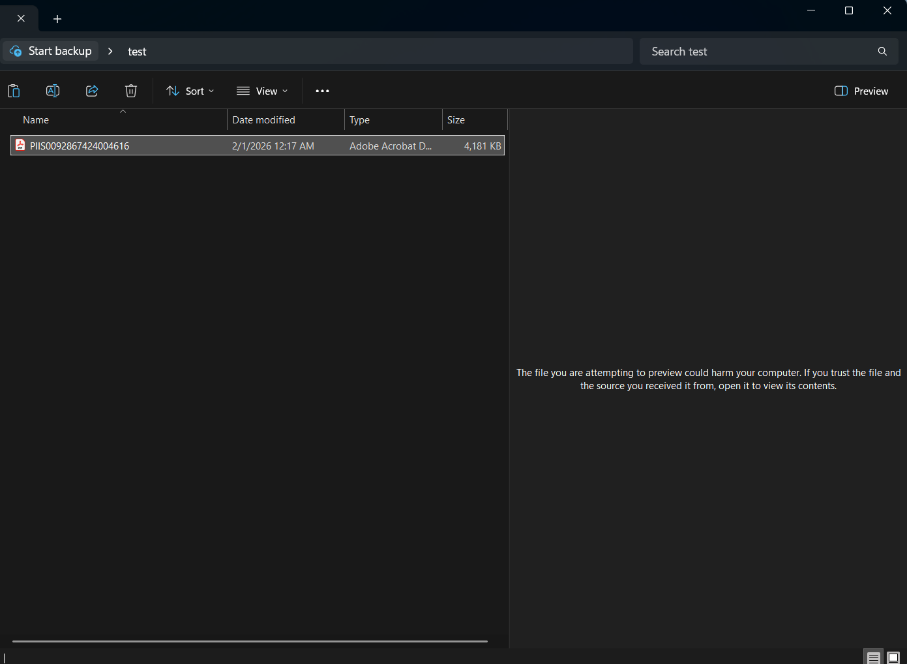
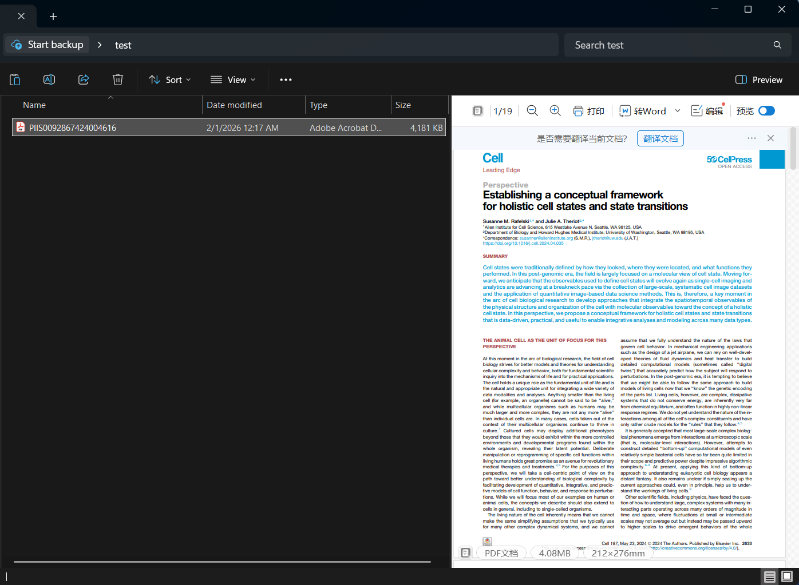
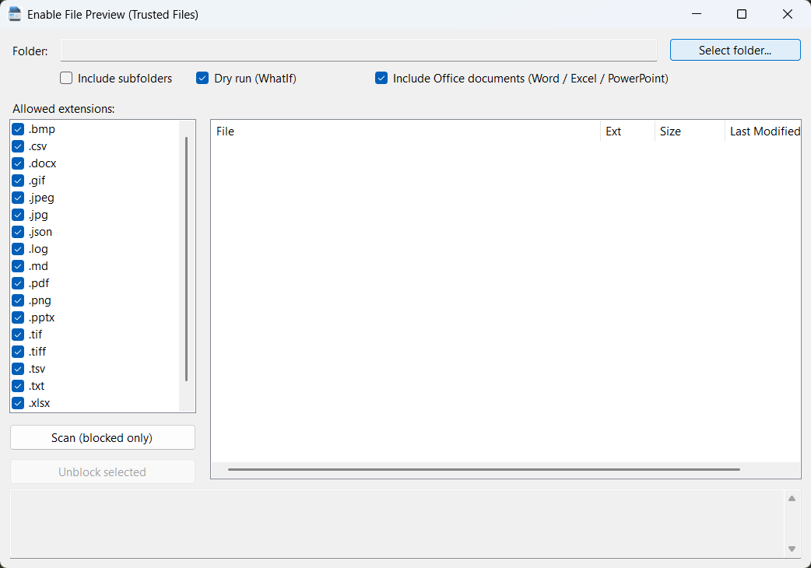

# UnblockFilePreview <a href="https://github.com/wbvguo/UnblockFilePreview/"></a>


When previewing files downloaded from the internet, you may see this warning:

> **"The file you are attempting to preview could harm your computer. If you trust the file and the source you received it from, open it to view its contents."**

This happens because Windows marks downloaded files with a "Mark of the Web" (MOTW) flag, which blocks preview functionality for security reasons. **UnblockFilePreview** removes this flag from trusted files, enabling preview in File Explorer for PDFs, images, text documents, and other blocked files.


## Before and After UnblockFilePreview

**Before:** Files downloaded from the internet cannot be previewed in File Explorer and show a security warning.



**After:** Files can be previewed normally in File Explorer as trusted files.




## Installation

**Requirements:**
- Windows OS
- .NET 8.0 SDK (download from [Microsoft](https://dotnet.microsoft.com/download/dotnet/8.0) if not already installed)


### Option 1: Download Release Executable
**Download and Run:**
1. Download the latest release executable from the [Releases](https://github.com/wbvguo/UnblockFilePreview/releases) page
2. Extract the files to a folder of your choice
3. Run `UnblockFilePreview.exe` (no installation required)

### Option 2: Build from Source

**Building:**

1. Clone or download this repository
2. Open a terminal in the project directory
3. Restore dependencies and build:
   ```bash
   dotnet restore
   dotnet build
   ```
4. Run the application:
   ```bash
   dotnet run
   ```
   
   Or build a release executable:
   ```bash
   dotnet publish -c Release
   ```
   The executable will be in `bin/Release/net8.0-windows/publish/`

## Usage

### Interface Overview



### Step-by-Step Guide

1. **Select a folder**: Click "Select Folder" to choose the directory containing files you want to unblock.

2. **Configure options**:
   - **Recurse subfolders**: Check this to scan files in subdirectories as well
   - **Include Office docs**: Check this to include Microsoft Office files (.docx, .xlsx, .pptx) in the scan
   - **File types**: Select which file extensions to scan for (default includes PDFs, images, and text files)

3. **Scan for blocked files**: Click "Scan" to find files that are blocked from preview. The results will appear in the file list.

4. **Review files**: Browse the list of blocked files. You can see the file path and status.

5. **Dry run (optional)**: Check "Dry Run" to see what would be changed without actually modifying any files. This is recommended for first-time use.

6. **Unblock files**: 
   - Select one or more files from the list
   - Click "Unblock Selected" to remove the "Mark of the Web" flag from the selected files
   - The log area will show the results of the operation

> **Safety note:** Only unblock files from sources you trust! This utility removes Windows security warnings, so use it responsibly.

## Project Details

- **Framework**: .NET 8.0 Windows
- **UI**: Windows Forms
- **Target**: Windows executable (WinExe)
- **Dependencies**: Ookii.Dialogs.WinForms (v4.0.0) - Provides Windows-style folder selection dialogs
